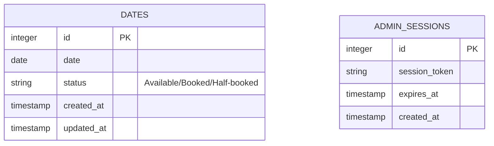
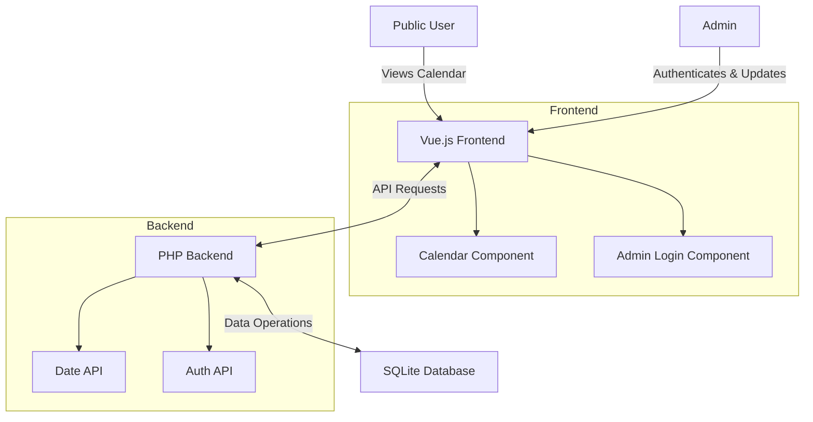
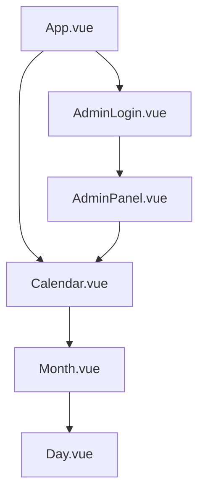
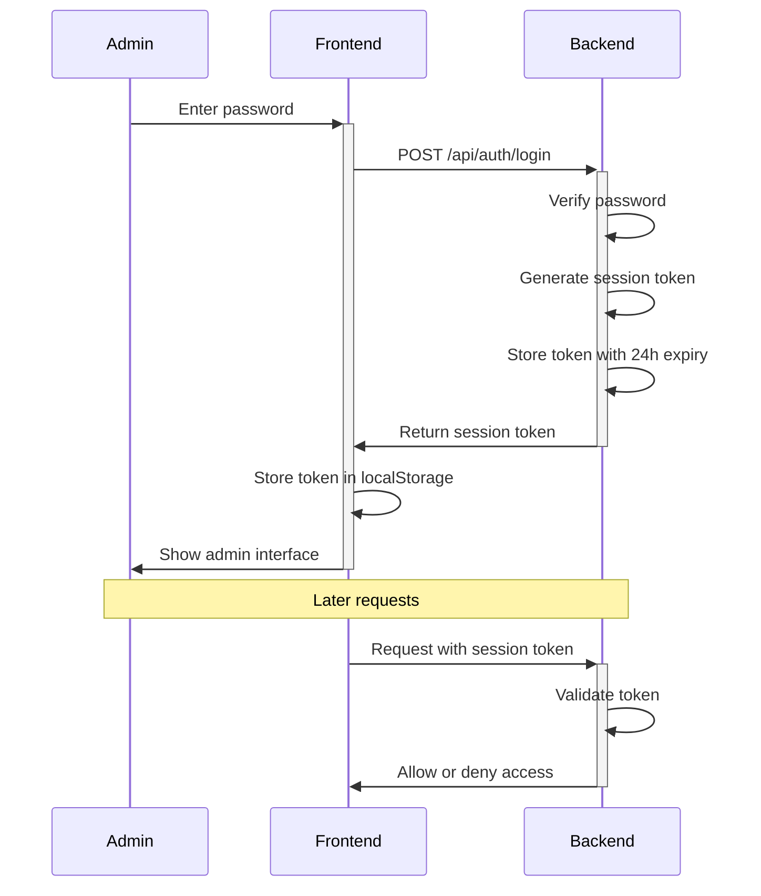

# Booking Calendar System


## System Overview

The system will consist of:

1. A full-year calendar view displaying 12 months at once (skipping past dates)
2. Three possible states for each date: Available, Booked, or Half-booked
3. Admin functionality with password protection and 24-hour session persistence
4. Public view for anyone to see the calendar states

## Technology Stack

- **Frontend**: Vue.js with shadcn components and Tailwind CSS
- **Backend**: PHP
- **Database**: SQLite

## Database Design



## System Architecture



## Component Structure



## API Endpoints

1. **GET /api/dates** - Get all dates and their statuses
2. **POST /api/dates/{date}** - Update status for a specific date (admin only)
3. **POST /api/auth/login** - Admin login
4. **POST /api/auth/logout** - Admin logout
5. **GET /api/auth/check** - Check if admin session is valid

## File Structure

```
lite-booking/
├── public/
│   └── index.html
├── src/
│   ├── assets/
│   ├── components/
│   │   ├── Calendar.vue
│   │   ├── Month.vue
│   │   ├── Day.vue
│   │   ├── AdminLogin.vue
│   │   └── AdminPanel.vue
│   ├── lib/
│   │   └── utils.js
│   ├── App.vue
│   └── main.js
├── api/
│   ├── config/
│   │   └── database.php
│   ├── models/
│   │   ├── Date.php
│   │   └── Session.php
│   ├── auth.php
│   └── dates.php
├── database/
│   └── calendar.sqlite
├── package.json
├── tailwind.config.js
└── vite.config.js
```

## Technical Details

### Authentication Flow



## User Experience

### Public View
- Full year calendar showing all 12 months
- Past dates are hidden/disabled
- Each date shows its status with both color and text label
- Simple, clean interface focused on readability

### Admin View
- Same calendar view as public
- Clickable dates that show a dropdown of state options
- Visual feedback when state is changed
- Session persistence for 24 hours
- Logout option


## Installation and Usage

### Prerequisites

- PHP 7.4 or higher
- Node.js 14 or higher
- npm or yarn

### Installation

1. Clone the repository:
   ```
   git clone github.com/lajlev/availability-calendar-php-sqlite.git
   cd availability-calendar-php-sqlite
   ```

2. Install frontend dependencies:
   ```
   npm install
   ```

3. Set up the database:
   The SQLite database will be automatically created when you first run the application.

### Running the Application

#### Development Mode

You can run both the frontend and backend servers with a single command:

```
php dev-server.php
```

This will start:
- PHP backend server at http://localhost:8000
- Vite development server at http://localhost:5173/

Alternatively, you can run them separately:

1. Start the PHP backend server:
   ```
   php -S localhost:8000 -t api
   ```

2. Start the Vite development server:
   ```
   npm run dev
   ```

#### Admin Access

You can edit admin password with `php api/update_password.php`

### Building for Production

1. Build the frontend:
   ```
   npm run build
   ```

2. Deploy the built files `/dist` along with the PHP backend `/api` to your web server.
