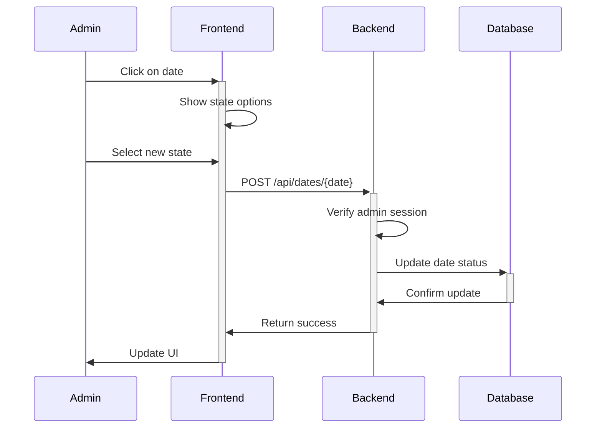

# Booking Calendar System


## System Overview

The system will consist of:

1. A full-year calendar view displaying 12 months at once (skipping past dates)
2. Three possible states for each date: Available, Booked, or Half-booked
3. Admin functionality with password protection and 24-hour session persistence
4. Public view for anyone to see the calendar states

## Technology Stack

- **Frontend**: Vue.js with shadcn components and Tailwind CSS
- **Backend**: PHP
- **Database**: SQLite

## Database Design


## System Architecture


## Component Structure


## API Endpoints

1. **GET /api/dates** - Get all dates and their statuses
2. **POST /api/dates/{date}** - Update status for a specific date (admin only)
3. **POST /api/auth/login** - Admin login
4. **POST /api/auth/logout** - Admin logout
5. **GET /api/auth/check** - Check if admin session is valid

## Implementation Plan

### 1. Project Setup

1. Initialize project structure
2. Set up Vue.js with Vite
3. Install shadcn-vue and Tailwind CSS
4. Set up PHP backend structure
5. Create SQLite database and tables

### 2. Backend Implementation

1. Create database connection and models
2. Implement date API endpoints
3. Implement authentication system with session management
4. Add middleware for admin route protection

### 3. Frontend Implementation

1. Create base components (App, Calendar)
2. Implement Month and Day components
3. Add state visualization (colors and text labels)
4. Create admin login component
5. Implement admin panel for changing date states
6. Add navigation and year view

### 4. Integration and Testing

1. Connect frontend to backend API
2. Test admin authentication
3. Test date state updates
4. Test public view
5. Ensure proper handling of past dates

### 5. Deployment

1. Package application
2. Set up server environment
3. Deploy application

## File Structure

```
lite-booking/
├── public/
│   └── index.html
├── src/
│   ├── assets/
│   ├── components/
│   │   ├── Calendar.vue
│   │   ├── Month.vue
│   │   ├── Day.vue
│   │   ├── AdminLogin.vue
│   │   └── AdminPanel.vue
│   ├── lib/
│   │   └── utils.js
│   ├── App.vue
│   └── main.js
├── api/
│   ├── config/
│   │   └── database.php
│   ├── models/
│   │   ├── Date.php
│   │   └── Session.php
│   ├── auth.php
│   └── dates.php
├── database/
│   └── calendar.sqlite
├── package.json
├── tailwind.config.js
└── vite.config.js
```

## Technical Details

### Authentication Flow


### Date State Management



## User Experience

### Public View
- Full year calendar showing all 12 months
- Past dates are hidden/disabled
- Each date shows its status with both color and text label
- Simple, clean interface focused on readability

### Admin View
- Same calendar view as public
- Clickable dates that show a dropdown of state options
- Visual feedback when state is changed
- Session persistence for 24 hours
- Logout option

## Development Timeline

1. **Project Setup**: 1 day
2. **Backend Implementation**: 2 days
3. **Frontend Implementation**: 3 days
4. **Integration and Testing**: 1 day
5. **Deployment**: 1 day

**Total Estimated Time**: 8 days

## Installation and Usage

### Prerequisites

- PHP 7.4 or higher
- Node.js 14 or higher
- npm or yarn

### Installation

1. Clone the repository:
   ```
   git clone https://github.com/yourusername/lite-booking.git
   cd lite-booking
   ```

2. Install frontend dependencies:
   ```
   npm install
   ```

3. Set up the database:
   The SQLite database will be automatically created when you first run the application.

### Running the Application

#### Development Mode

You can run both the frontend and backend servers with a single command:

```
php dev-server.php
```

This will start:
- PHP backend server at http://localhost:8000
- Vite development server at http://localhost:3000

Alternatively, you can run them separately:

1. Start the PHP backend server:
   ```
   php -S localhost:8000 -t api
   ```

2. Start the Vite development server:
   ```
   npm run dev
   ```

#### Admin Access

The default admin password is `admin123`. You can change this in the `api/models/Session.php` file.

### Building for Production

1. Build the frontend:
   ```
   npm run build
   ```

2. Deploy the built files along with the PHP backend to your web server.
